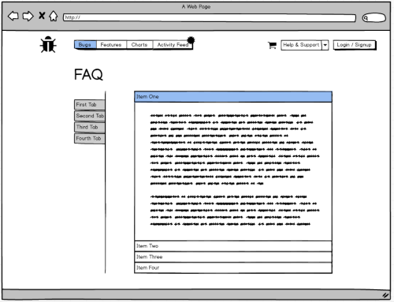
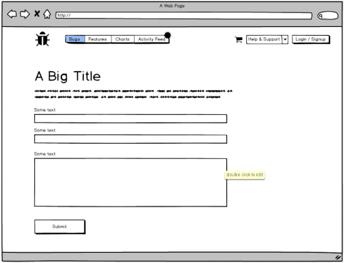

# Build an Issue-Tracker (milestone project 5)

*Python and JavaScript Full Stack Project by [Sean Murphy](https://github.com/nazarja)*

*Django, Django Rest Framework, Vanilla JavaScript, jQuery, Semantic UI, BeardCSS*

---

## Table of Contents

1. [Overview](#Overview)
2. [Planning](#Planning)
3. [Content Structure](#Content-Structure)
4. [UX-Design](#UX-Design)
5. [Database](#Database)
6. [Features](#Features)
7. [Technologies](#Technologies)
8. [Testing](#Testing)
9. [Deployment](#Deployment)
10. [Credits](#Credits)

---

## Overview

- Issue Tracker is a Bug and Feature Ticket Creation site where users can create tickets which can then be voted on to increase the tickets rank to be worked on by the in-house developers.
- The main development features included the login system, activity feed and ticket creation editing and commenting on those tickets.
- The login system uses django AllAuth and allows users to sign up and in with Github as well as the option of just using a username and email address.
- The ticket section makes good use of pagination, filtering and search functions as well as server side rendering to enhance to user experience.
- Commenting on a ticket is a breeze, CRUD operation can be performed on comment, including inline editing, the comment itself will turn into an editable input for ease of use.
- Editing Creating a ticket looks great with a live preview while you type of how your ticket will look live, with friendly indicators of how many characters you can have left to use.
- The design for the website's concept is based on the use of lots of primary colors, a clean interface and takes inspiration and heavy usage of Semantic UI's design principles. 
- I hope you enjoy viewing and using this site as much as I have had building it (tough as it was)!

---

## Planning

1. Pre-Development Notes  
    - Created pre-development Notes
    - Set out the User Stories
    - Created Wireframes using Balsalmic Software
    - Set out the Functionality Expectations

2. Set User Stories
    - As a user ... I can see what the site is about and its purpose before signing up.
    - As a user ... I can view documentation to how the site works and any faq's.
    - As a user ... I have the option to sign up / sign in with a local profile or my github profile.
    - As a user ... If I forget my password, I can reset it.
    - As a user ... I can delete my account and all tickets associated with it.
    - As a user ... I can see charts indicating the highest voted and most tended to bugs and features.
    - As a user ... I can see an activity feed of recent actions by users site wide.
    - As a user ... I can create / edit / update / delete my own tickets for a bug / feature. 
    - As a user ... I can create / edit / update / delete my own comments for a bug / feature.
    - As a user ... I can add / remove my own up-vote to another users bug/feature.
    - As a user ... I can make a payment to up-vote a feature which will be reflected in the sites most tended to charts.
    - As a user ... I can view and perform actions on the site on a mobile device comfortably. 

3. Functionality Specifications
    - create superuser and staff with ability to manage tables via the admin panel
    - create login system with django all-auth to allow signing up with github
    - create frontend pages to advertise the site to encourage users to sign up
    - create documentation to show users how to use the site its features.
    - create charts showing bugs / features with highest up-votes (daily, weekly , monthly)
    - create priority based queue tickets system for bugs and features
    - create ability for users to comment on tickets
    - ensure that the user experience is complemented with ajax to limit page refreshes
    - create an multiple api's with django-rest-framework for the above statement
    - create recent activity stream to be show on users profile page
    - create stripe checkout system for feature up-votes

 4.  Design Specifications  
- branding colors = [  
&nbsp;&nbsp; green: #00ba51,   
&nbsp;&nbsp; red: #df2a2b,  
&nbsp;&nbsp; gray: #dfe0e1,  
&nbsp;&nbsp; black: #212222,  
&nbsp;&nbsp; white: #ffffff,  
]
    - use the issue tracker logo and branding colors ( front-end and admin )
    - use an avatar to represent users profile pictures
    - keep design minimal and clean with appropriate use of white space
    - all pages must be mobile friendly
    - use css framework such as semantic-ui or ui-kit

---

## Content-Structure

To simplify user experience and encourage users to sign up! Most features of the website are behind the login experience. Each App is dedicated and for the most part self contained to the content that it provides. 

Sitemap:
    
    
### Front-end pages:

*Unregistered users*
-  home
-  faq
-  contact
-  login 
-  register

*Registered users*
- home
- faq
- charts
- bugs
- features
- activity feed 
- profile
- change password
- change avatar image

### Django apps used the create the site:  

- pages [ home, faq, profile ]
- profiles ( all-auth incl. github / avatar profile )
- charts ( charts.js )
- tickets [ bugs, features ] (class based, rest framework based) 
- comments (rest framework based)
- cart (session and context processor based)
- checkout ( stripe )
- contact (contact form)
- activity feed (users and personal activity feeds)

---

## UX-Design

UX, Colors and Design

For this project I decided to choose Semantic UI as a base framework due to their massive component library which I thought would suit the project well. At first getting to grips with the library was a bit of a struggle, as while the documentation and examples are good, when I needed to override a css rule or position something differently to how it was intended, it was proved quite the challenge.

In *many* cases I found myself needing to use the *!important* rule but tried to keep it to a minimum as much as I could. Overall the library served its purpose as really adds to the websites functionality. 

One thing missing was a library for basic css, as I was trying to focus my efforts on the Python and JavaScript side of things I used BeardCSS for adding padding, margins etc.. as class selectors, which is a tiny file and did a great job and really quickened development at times.

Considering the fact that there would be a lot of whitespace in the project, I decided to go with using many primary colors throughout to highlight elements and a gradient green to blue as the main theme. This is shown is the use of buttons and highlighted text, despite "Blue and Green, never be seen ...."

The logo was created by myself in Photoshop at is used throughout the site as also when signing up which github you'll see the logo to affirm its IssueTracker your're signing up too. I think a nice touch.

#### Wireframes:

[home](planning/wireframes/home.png)    
  
[tickets](planning/wireframes/tickets.png)    
  
[details](planning/wireframes/details.png)    
  
[charts](planning/wireframes/charts.png)    
  
[activity-feed](planning/wireframes/activity-feed.png)    
  
[faq](planning/wireframes/faq.png)    
  
[contact](planning/wireframes/contact.png)      
  

---

## Database

The database is designed with the user in mind, I have tried to center all database to be linked to  a single user with a `Foreign key`, a OneToOne relationship at also a few `ManyToMany` relationships. The idea behind this, asides from ownership, is to be able to build the additional activity feed, where you are able to see other users activity on the feed and what action they have performed.

Examples of usage are: 
- Profile model receive a OneToOne with the `settings.AUTH_USER_MODEL`.
- Tickets can contain many users that have liked a ticket, and a user can like many tickets (`ManyToMany`)
- Comments can only have one ticket and one user, so two Foreign Keys are used for this purpose.

To provide easily look ups for the activity feed I used ModelMangers on 4 models which return a `|` of two separate queries joined together. One excludes the user, and one filters by the user. To ensure that the users profile feed always will contain results.

For any Foreign Key relationships that allow anonymous users to create an object, such as the contact form, or in the admin panel, the default user is set to the Admin so `default=1`

Nearly all models contain a created and updated and user fields. In many cases it was necessary to override to save method of the model to assign the current user to the model by retrieving the user from the request object.

One major issue I had was that I used django all-auth as an accounts manager, while this was excellent, a feature I implemented required some additional research.

To give each user an avatar and the ability to change their avatar image and associate the avatar to them when displaying a comment, ticket etc.. I needed to hook into the post_save and pre_save signals that are sent on creation. That way I could intercept a login or signup, grab the instance object and create a Profile object from that linking a `OneToOn`e field with the user model.

---

## Features

#### Accounts / Profiles  

- used django all-auth to handle user login, signup, password resets ...
- Ability to sign up/in with Github, if you wish to set a password afterwards for a full account, you can.
- you can sign in with either your email or username, both of which must be unique.
- Welcome email, forgot password email, and verify email address email are sent, which I have included custom html templates for, any links an email such as password reset are now a button to click to be redirected to reset your password.

#### Activity Feed

- Here you will be able view recent users activity and your own personal activity on the same page but in separate tabs.

- You'll see actions such as:
    - when making new comments on a ticket.
    - when creating a new bug or feature.
    - when a new user joins the site.
    - when purchasing votes for a feature, and the number of votes.
    
The activity feed acts as the homepage when logged in as you wont be able to see the main '/' homepage.

I have used the ModelsManagers to gather queryset's for me, and then I have used chained to results together to send to the frontend as a single object_list. In order to tell which object was which while iterating the object list, i needed to create a template-tag library for this app. Which return the model `class name`. Knowing this information in the template helped me decide what kind of html to generate for that particular action.

#### Avatars

- Everyone is assigned a random Avatar image upon signing up to the site.
- You can change your avatar from the avatar gallery which a decent selection to chose from.
- changes are instant are are then reflected on all new and pre-existing actions you've made.

I have used JavaScript to make post requests to make this experience as seamless as possible  interacting with a generic class based view on the backend.

#### Tickets

Where there's Code, there's a Bug!

- Tickets are free to create and voting increases popularity.
- You can view the most recently created tickets and paginate through the results.
- You can  the search bar will search through all tickets titles and description's for your search term.
- You can use filter will filter your results, you can also search and filter results together.
- If your search become to narrow, you can the reset all button to start again.
- You can only vote on for a bug once, and you cant vote for your own bug.
- To vote for a feature, a small fee is required, a discount is given for purchasing a double vote.

The tickets app makes use of django's class based views, namely `ListView, DetailView, CreateView, UpdateView` to do most of the heavy lifting for me. When I needed to filter or search, delete or vote I used JavaScript to interact with the `rest framework`. Default pagination is set to 8 in base.py and the default pagination class is `PageNumberPagination`. 

#### Comments

Comments are organised from the most the recent, just underneath the tickets details.

- Post a comment and while you are typing, keep note of how many characters you have left.
- Update a comment on the spot where the text field will be converted to a text input prepopulated with your comments content.
- Remove a comment, You'll be asked to confirm this in case you change your mind.
- If there are no comments yet, you'll see a placeholder indicating that there are none.

Comments solely interact with the rest framework, while the ticket details page is loaded a JavaScript request is sent to the ListAPIView, any other CRUD operation are perform in the same manner, JavaScript perform the DOM operation and `GET,POST,PUT,DELETE` request and django rest performs the object action and returns a serialized response.

#### Details Page /  Create / Update Ticket

The Details, Create and Edit page share the same ticket details, preview, the difference being one is editable.

- If you are the owner you''ll have the ability to select edit ticket, other wise you'll see the vote or purchase buttons depending on if its a bug or a feature.
- A preview is provided so you can see how it will look live, you'll  have live feedback on how many remaining characters you have left to write.
- If you are editing the ticket, you'll have the option to delete the ticket, you'll be required to confirm that you wish to delete it again.

#### Cart

You can support features by buying votes and adding the ticket to your cart. 

- You'll see an itemised list of the items you have chosen.
- You have the option to purchase multiple votes, both single and double. Each item will be a separate item, this is a chosen design.
- You'll see an itemised list of the items you have chosen, the votes and cost of that item.
-You have the ability to remove any items for your cart by selecting the remove item button and clicking the update cart button.
- An updated total price and item list will then be revised.
- As you click buy votes, you'll see your cart item number increase.
- Items will stay in your cart until you logout.

Ive followed the CI videos partly on this one for creating the context processor which makes for example a cart_items variable available throughout the site, in conjunction with session variables.

As I allowed multiple instances of the same object therefore having the same id, i gave each added ticket a timestamp. When the user remove an item from their cart via a checkbox, only checkboxes that are not checked are gathered and if the timestamp is in the session cart, it can remain, otherwise its gone. And on the next page refresh the context processor will do its job of generating a new context list of tickets still in the cart which the unwanted removed.

#### Payments / Stripe

- You'll be able to review your basket once more and see the final charges.
- I have used Stripe own "Elements" code for taking and validating your cards details from their example on the official website, this does a great job and looks great.
- Upon successful payment, you'll be notified and brought to a success screen where you can then continue to another area of of site.
- if the payment has failed, you will be prompted to try again.

One of the great reasons to use Stripe is not asking the customer for all their details, in a lot of cases its necessary, but I dont see any good reason for this site, so I have left that out by design.
No card details are stored as Stripes JavaScript generated a token to be used for the charge.

#### Contact Form

- Both logged in an anonymous users can use the contact form.
- A contact form consisting of name, email, subject and message fields.
- Logged in users will have some of their details pre-populated and are not editable.
- After you've submitted the form, you'll receive an email confirming that we have got your message.

This was the first model I attempted and had to figure out a way that unregistered users can send a query email while logged in users did not need to enter their name or email address.
By default the admin user is the sender of the email, if the user is not logged in and logged in users cannot edit their name or email address.

---

## Technologies

> *Python, Django, Django Rest Framework, Jinja, Django AllAuth, Postgres, Sqlite3, JavaScript, JSON, JQuery, Chart.js, CSS, Semantic UI, BeardCSS, MailGun, Git, Heroku*  
 
- Python  
https://docs.python.org/3/  
Used as the backend language  

- Django   
https://www.djangoproject.com/   
Used as the main framwework to create, serve, and interact with the application. 

- Django Rest Framework  
https://www.django-rest-framework.org/   
Used in conjuction with JavaScript to enhance the user experience and, also performs view creations in the form of List, Create, Update, Delete. And well as the testing on the api frontend.

- Django's Jinja   
http://jinja.pocoo.org/  
Used for the html templates, make good use of partials, template tags and filters. 

- Django AllAuth  
https://django-allauth.readthedocs.io  
Used to manage the user auth model, including social authentication and user management.

- Postgres - Sqlite3  
https://www.postgresql.org/
Sqlite3 was used in Development, Postgres is used on the Heroku deployed application.

- Pycharm  
https://www.jetbrains.com/pycharm/  
Pycharm was used to develop the project and came in really useful for its built in tools including linting, code suggestions, error checking and viewing the sqlite database.

- JavaScript  
https://www.ecma-international.org/   
JavaScript was used extensively for making request to the django backend for query data, as well as DOM manipulation. Provideing a good user experience to a lot of the application.  

- JSON  
https://www.ecma-international.org/  
JSON responses was often sent and returned by both the front and backend for data communication between them both.

- CSS, BearsCSS, Semantic UI  
http://www.w3.org/Style/CSS/members    
http://buildwithbeard.com/  
https://semantic-ui.com/  
Semantic UI was the main CSS Framework of choice, although it is mainly a component library and I sought out BeardCSS for applying classes that altered padding and margins.

- Chart.js  
https://www.chartjs.org/  
Chart.js is used to create the graphs, JavaScript requests data from the backend and passes the data to chart.js and with a little configuartion, charts are born.

- JQuery  
https://jquery.com/    
JQuery is a requiremnet of Semantic UI, and is used to initiate some of semantics components such as tab-able menu's, modals and popups 

- Stripe  
https://stripe.com/ie  
Stripe is used as the payment processor for charging credit or debit cards, only the card number is used.

- WhiteNoise  
http://whitenoise.evans.io/en/stable/   
WhiteNoise is used to serve the staticfiles of application when its live on the Heroku Server

- MailGun  
https://www.mailgun.com/  
MailGun was used to send emails, which are rooted through a sub-domain of my personal website.

---

## Testing

####  Automated written tests

#### Browser Testing

####  User testing

---

## GIT

Git has been used extensively through the entire project build. I have regularly made commits at each meaningful stage and also at regular intervals to save me work.

I have created different branches to develop important apps such as the tickets app and the comments app. On completion, I would then merge the branch into the master branch and push to github.

I have made use of the .gitignore file to exclude my unneeded files such as pycache, venv and pycharm files and folders.

Unsure of what to exclude for django I referenced gitignore.io for a generic django template to help me decide what to exclude from pushing to github. 

---

## Deployment

#### Deployment to Heroku

For this project deployment to heroku was a little more complected than previous projects, where I had found it easy just to link my repository through the github dashboard and deploy from there, as I had opted to contain the project inside a `src` folder and as Heroku expects the projects files to be in the root directory, the deploy failed.

To overcome this issue, with a quick google I found that git has a `subtree` command. Perfect. As setting the heroku remote, I could push to heroku with the command `git subtree push --prefix src heroku master`.

My deployment process was as follows:
- Finalise that all `print()`, `console.log()` statement had been removed and that the application is working as expected.
- Installed `whitenoise` and configured my settings file for it, performed a test with debug off and collected staticfiles to ensure it worked and the 404, 500 pages work as expected.
- Installed `heroku-cli` on my machine, logged in and added the heroku remote to git.
- On heroku I added the Postgres add-on .   
- Installed pillow, dj-database-url and gunicorn.
- Created a Profile, runtime.txt and requirements.txt
- Further set-up my settings (production.py) to read from the env vars on Heroku which I set it.
- Pushed to heroku and when the build process had successfully finished, ran migrations and created a superuser.
- The application was now fully deployed and ready for the database to be populated. 

#### Setting the project up in a local development environment

*My settings files are split into `base.py`, `local.py` and `production.py`*
*Local.py is excluded from the online repository.

**Tools you may need:**  

Python 3 installed on your machine https://www.python.org/downloads/
PIP installed on your machine https://pip.pypa.io/en/stable/installing/
Git installed on your machine: https://gist.github.com/derhuerst/1b15ff4652a867391f03
A text editor such as Pycharm https://www.jetbrains.com/pycharm/ or https://code.visualstudio.com/ Visual Studio Code
A free account at https://www.mailgun.com/ MailGun

**Instructions**

###### Setting up the project files  

- Click the download zip button on the github repository or open a terminal and enter `git clone`https://github.com/nazarja/issue-tracker.git
- if possible open a terminal session in the unzip folder or `cd` to the correct location
Next your need to install a virtual environment for the python interpreter, I recommend using pythons built in virtual environment. Enter the command `python -m venv venv` . NOTE: Your python command may differ, such as `python3` or `py`.
- Activate the `venv` with the command `source venv/bin/activate`, again this may differ depending on your operating system, please check https://docs.python.org/3/library/venv.html for further instructions.
- If needed, Upgrade pip locally by `pip install --upgrade pip`.
- Install all required modules with the command `pip -r requirements.txt`.
- In the `src/project/settings/` folder create a new file called `local.py`. Copy all the values from `production.py` to this file. You'll now need to change the values of all variables to your personal values.
** Note: You'll need to set up an account at Stripe and Mailgun to get your personal api keys**
- Once that has been done, you may `cd` into the `src` folder and run `./manage.py migrate`
- Followed by `./manage.py createsuperuser`, and follows the prompts in the terminal.
- launch the application with `./manage.py ruunserver`
- The application should now be launch-able, but not quite fully functional just yet.    

###### Setting up Github Social Login Integration

- On Github set up a new OAuth application at https://github.com/settings/applications/new
- follow the onscreen instructions, your Homepage URL should be `http://127.0.0.1:8000`, and the Authorization callback URL should be `http://127.0.0.1:8000/accounts/github/login/callback`
- Login to the admin panel as the superuser you have just created, the admin panel is located at `127.0.0.1:8000/admin`  
- Navigate to the `Sites` link, followed by a link called `example.com`. 
- Change the Domain name to `127.0.0.1` and save
- Back at the admin panel index, navigate to `Social applications`  and click add new social application
- Add `Github` as the name and provider, fill in your ClientID and Secret Key from the github application you registered, and choose the site you created a few steps previously, 127.0.0.1

*That's it, you should be good to go!* 

---

## Credits

Aside from the aforementioned below, all code is my own work, referencing and making use of official documentation when needed.

###  Content and Media

##### Images

- avatar images are taken from Semantic UI's example avatars 
- github logo and image are taken from https://github.com
- callout background image under the gradient taken from https://wallhere.com

#### Code  

- Busy Loader: https://tobiasahlin.com/spinkit/
- Learned the admin styling from Brad Traversy of https://www.traversymedia.com/

#### Thanks  

Stack Overflow was an unbelievably source of information for this project and I think I browsed my pages on Stack Overflow than I could remember. No code is a direct copy.

I payed for a month's subscription to the course's on codingforentrepreneurs.com where I learned how to use the rest framework and class based views. Credit to Justin for being an awesome teacher, and diving into deep parts of django.