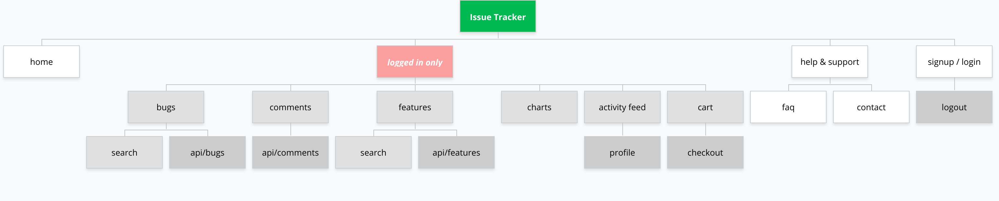

# App Requirements

---

## Functionality Specifications

- create superuser and staff with abitily to manage tables via the admin panel
- create login system with django allauth to allow signing up with github
- create frontend pages to advertise the site to encourage users to sign up
- create documentation to show users how to use the site its features.
- create charts showing bugs / features with highest upvotes (daily, weekly , monthly)
- create proiority based queue tickets system for bugs and features
- create abiltity for users to comment on tickets
- ensure that the user experience is complemented with ajax to limit page refreshes
- create an multiple api's with django-rest-framework for the above statement
- create recent activity stream to be show on users profile page
- create stripe checkout system for feature upvotes

--- 

## Design Specifications

- branding colors = [  
&nbsp;&nbsp; green: #00ba51,   
&nbsp;&nbsp; red: #df2a2b,  
&nbsp;&nbsp; gray: #dfe0e1,  
&nbsp;&nbsp; black: #212222,  
&nbsp;&nbsp; white: #ffffff,  
]
- use the issue tracker logo and branding colors ( front-end and admin )
- use an avatar to represent users profile pictures
- keep design minimal and clean with appropriate use of white space
- all pages must be mobile friendly
- use css framework such as semantic-ui or ui-kit

---

## User Stories

- As a user ... I can see what the site is about and its purpose before signing up.
- As a user ... I can view documentation to how the site works and any faq's.
- As a user ... I have the option to sign up / sign in with a local profile or my github profile.
- As a user ... If I forget my password, I can reset it.
- As a user ... I can delete my account and all tickets associated with it.
- As a user ... I can see charts indicating the highest voted and most tended to bugs and features.
- As a user ... I can see an activity feed of recent actions by users site wide.
- As a user ... I can create / edit / update / delete my own tickets for a bug / feature. 
- As a user ... I can create / edit / update / delete my own comments for a bug / feature.
- As a user ... I can add / remove my own upvote to another users bug/feature.
- As a user ... I can make a payment to upvote a feature which will be reflected in the sites most tended to charts.
- As a user ... I can view and perform actions on the site on a mobile device comfortably.

---

## Sitemap:

  

### Django Apps

- pages [ home, faq, profile ]
- accounts ( allauth incl. github )
- charts ( charts.js )
- tickets [ bugs, features ]
- comments
- cart
- checkout ( stripe )
- activity feed

### Front-end pages:

*Unregistered users*
-  home
-  faq
-  contact
-  login 
-  register

*Registered users*
- home
- faq
- charts
- bugs
- features
- activity feed 
- profile
